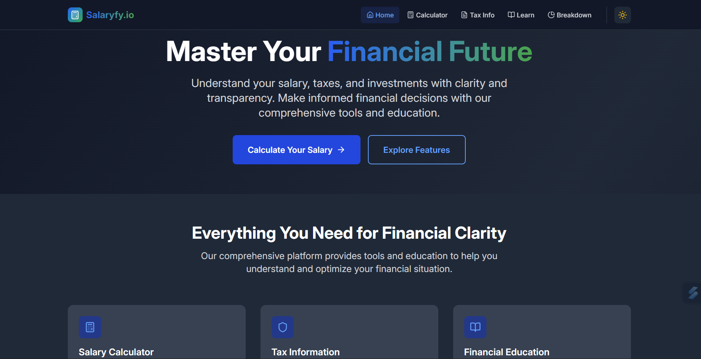
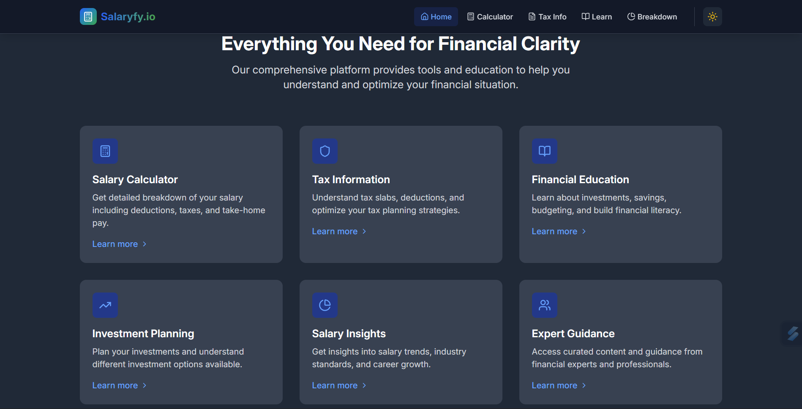
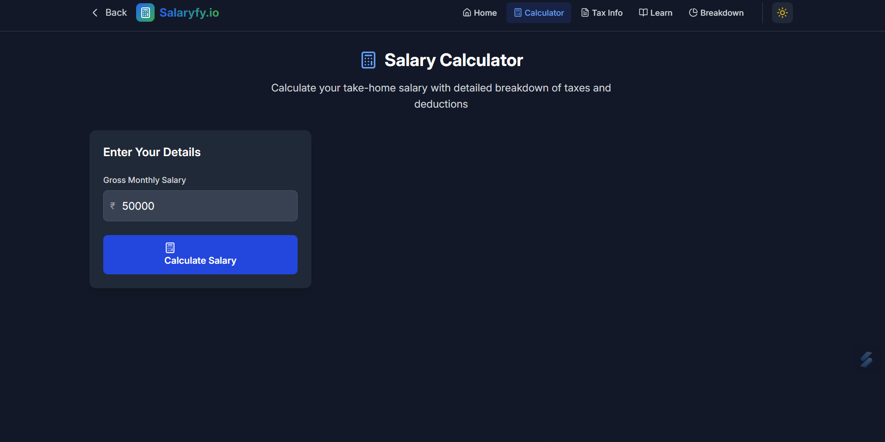
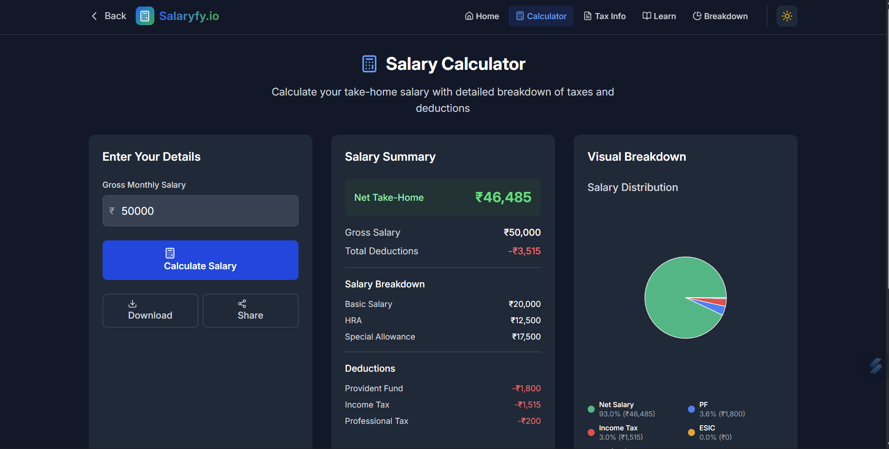
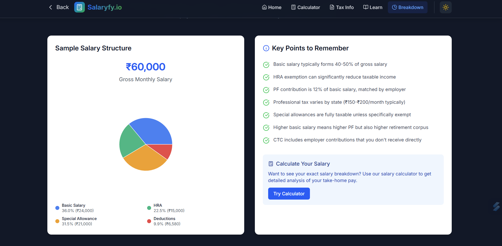
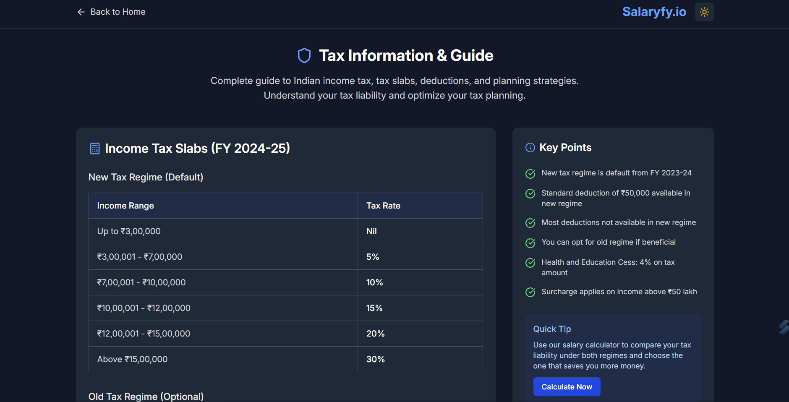

# 💰 Salaryfy.io - Financial Awareness & Salary Management Platform

<div align="center">

  <p><em>Empowering financial decisions through clarity and transparency</em></p>
  
  [](https://salaryfy-io-phi.vercel.app/)
  [](https://reactjs.org/)
  [](https://www.typescriptlang.org/)
  [](https://tailwindcss.com/)
</div>

## 🌟 Project Overview

**Salaryfy.io** is a comprehensive financial awareness platform designed to help individuals understand their salary, taxes, and investments with clarity and transparency. Built as part of a Frontend Developer Internship assignment, this platform empowers users to make informed financial decisions through interactive tools and educational content.

### 🎯 Brand Perspective
Salaryfy represents clarity, transparency, and financial literacy. The brand stands for empowering individuals with the knowledge and tools needed to understand their finances, optimize tax planning, and build wealth through informed decision-making.

## ✨ Features

### 🧮 Interactive Salary Calculator
- **Detailed Breakdown**: Complete salary analysis including basic salary, HRA, allowances, and deductions
- **Tax Calculations**: Accurate income tax calculations based on current Indian tax slabs
- **Visual Charts**: Interactive pie charts and bar graphs for better understanding
- **Download & Share**: Options to save and share salary breakdowns
- **Real-time Updates**: Instant calculations as you input your salary details

### 📈 Tax Information & Guide
- **Current Tax Slabs**: Updated information for FY 2025-26 (both new and old regimes)
- **Deduction Guide**: Comprehensive guide to popular tax deductions (80C, 80D, HRA, etc.)
- **Tax Planning Tips**: Expert advice on optimizing tax liability
- **Regime Comparison**: Tools to compare tax liability under both regimes

### 📚 Financial Education Hub
- **Learning Path**: Structured curriculum from basics to advanced financial planning
- **Topic Categories**: Budgeting, investing, tax planning, credit management, and more
- **Featured Articles**: Curated content on current financial topics
- **Interactive Tools**: Links to various financial calculators and planners

### 💼 Salary Breakdown Guide
- **Component Analysis**: Detailed explanation of salary components
- **Visual Representations**: Charts showing typical salary structures
- **Negotiation Tips**: Professional advice for salary discussions
- **Industry Standards**: Insights into standard practices

## 🛠️ Technology Stack

- **Framework**: React 19 with React Router 7
- **Styling**: TailwindCSS 4.x
- **Build Tool**: Vite 6.x
- **Animations**: Framer Motion
- **Charts**: Recharts
- **Icons**: Lucide React
- **Language**: TypeScript
- **Deployment**: Vercel (Production ready)

## 🚀 Quick Start

### Prerequisites
- Node.js 18+ 
- npm or yarn package manager

### Installation

1. **Clone the repository**
   ```bash
   git clone <repository-url>
   cd salaryfy-app
   ```

2. **Install dependencies**
   ```bash
   npm install
   ```

3. **Start the development server**
   ```bash
   npm run dev
   ```

4. **Open your browser**
   Navigate to `http://localhost:5173` (or the port shown in your terminal)

### Build for Production

```bash
npm run build
```

### Preview Production Build

```bash
npm run start
```

## 📷 Adding Screenshots

### Screenshot Setup Instructions

To add actual screenshots to this README, follow these steps:

1. **Create screenshots directory**:
   ```bash
   mkdir screenshots
   ```

2. **Capture screenshots** of each page:
   - Homepage (Hero section)
   - Homepage (Features section) 
   - Calculator (Input form)
   - Calculator (Results with charts)
   - Tax Information page
   - Learning/Education page
   - Salary Breakdown page
   - Dark mode examples
   - Mobile responsive views

3. **Recommended screenshot specifications**:
   - **Desktop**: 1920x1080 resolution
   - **Mobile**: 375x667 resolution (iPhone SE)
   - **Format**: PNG for better quality
   - **Naming convention**: Use descriptive names as shown in the README

4. **Tools for capturing screenshots**:
   - **Browser DevTools**: For responsive screenshots
   - **Lightshot**: Quick desktop screenshots
   - **Snipping Tool**: Windows built-in tool
   - **Screenshot API**: For automated capture

5. **Optimize images**:
   - Compress images for web (use TinyPNG or similar)
   - Ensure consistent styling across screenshots
   - Capture in both light and dark modes

### Screenshot Checklist

- [ ] `logo.png` - Application logo/brand
- [ ] `homepage-hero.png` - Landing page hero section
- [ ] `homepage-features.png` - Feature cards section
- [ ] `calculator-input.png` - Salary calculator input form
- [ ] `calculator-results.png` - Results with charts
- [ ] `calculator-charts.png` - Close-up of charts
- [ ] `tax-info-page.png` - Tax information page
- [ ] `learn-page.png` - Financial education page
- [ ] `salary-breakdown.png` - Salary breakdown guide
- [ ] `dark-mode.png` - Dark theme example
- [ ] `mobile-responsive.png` - Mobile view

## 📸 Screenshots & Demo

### 🏠 Homepage - Hero Section
<div align="center">
  
  <p><em>Modern landing page with gradient background and call-to-action buttons</em></p>
</div>

### 🏠 Homepage - Features Section
<div align="center">
  
  <p><em>Feature cards showcasing platform capabilities with smooth animations</em></p>
</div>

### 🧮 Calculator - Input Form
<div align="center">
  
  <p><em>Clean and intuitive salary input form with real-time validation</em></p>
</div>

### 📊 Calculator - Results & Charts
<div align="center">
  
  <p><em>Comprehensive salary breakdown with interactive pie charts and bar graphs</em></p>
</div>

### 📊 Calculator - Visual Analytics
<div align="center">
  
  <p><em>Data visualization with Recharts showing salary distribution and components</em></p>
</div>

### 📈 Tax Information Page
<div align="center">
  
  <p><em>Comprehensive tax guide with current slabs and deduction information</em></p>
</div>

### 📚 Financial Education Hub
<div align="center">
  
  <p><em>Learning platform with structured courses and live financial news integration</em></p>
</div>


## 📱 Application Pages

- **Homepage** (`/`) - Landing page with hero section and feature overview
- **Salary Calculator** (`/calculator`) - Interactive salary calculation tool
- **Tax Information** (`/tax-info`) - Comprehensive tax guide and information
- **Financial Education** (`/learn`) - Educational content and learning resources
- **Salary Breakdown** (`/salary-breakdown`) - Detailed salary component guide

## 🏗️ Project Structure

```
salaryfy-app/
├── app/
│   ├── components/           # Reusable React components
│   │   ├── HomePage.tsx     # Landing page component
│   │   ├── SalaryCalculator.tsx
│   │   ├── TaxInfo.tsx
│   │   ├── Learn.tsx
│   │   └── SalaryBreakdown.tsx
│   ├── routes/              # Route definitions
│   │   ├── home.tsx
│   │   ├── calculator.tsx
│   │   ├── tax-info.tsx
│   │   ├── learn.tsx
│   │   └── salary-breakdown.tsx
│   ├── root.tsx            # Root layout component
│   ├── routes.ts           # Route configuration
│   └── app.css            # Global styles
├── public/                 # Static assets
├── package.json           # Dependencies and scripts
├── tailwind.config.js     # Tailwind CSS configuration
├── vite.config.ts        # Vite configuration
└── README.md             # Project documentation
```

## 💡 Key Features Implementation

### Responsive Design
- **Mobile-First**: Designed for mobile devices with progressive enhancement
- **Breakpoint System**: Tailored layouts for mobile, tablet, and desktop
- **Touch-Friendly**: Optimized interactions for touch devices

### Performance Optimizations
- **Code Splitting**: Route-based code splitting with React Router
- **Lazy Loading**: Components and images loaded on demand
- **Optimized Bundle**: Tree shaking and minification with Vite

### Accessibility
- **ARIA Labels**: Proper accessibility labels for screen readers
- **Keyboard Navigation**: Full keyboard navigation support
- **Color Contrast**: WCAG compliant color schemes
- **Semantic HTML**: Proper HTML structure and landmarks

## 🎨 Design Principles

### Brand Colors
- **Primary Blue**: `#3b82f6` - Trust and professionalism
- **Success Green**: `#10b981` - Growth and positive outcomes
- **Warning Amber**: `#f59e0b` - Important information
- **Danger Red**: `#ef4444` - Deductions and warnings

### Typography
- **Primary Font**: Inter (Google Fonts)
- **Font Weights**: Regular (400), Medium (500), Semibold (600), Bold (700)
- **Responsive Scale**: Fluid typography that scales with screen size

## 🔧 Available Scripts

| Command | Description |
|---------|-------------|
| `npm run dev` | Start development server |
| `npm run build` | Build for production |
| `npm run start` | Preview production build |
| `npm run typecheck` | Type checking with TypeScript |

## 🌐 Deployment

### Vercel 

1. **Connect Repository**: Link your GitHub repository to Vercel
2. **Configure Build**: Vercel automatically detects the build configuration
3. **Deploy**: Automatic deployment on every push to main branch

### Manual Deployment

```bash
# Build the project
npm run build

# The build/ directory contains the production build
# Upload contents to your hosting provider
```

## 📝 Assignment Compliance

### Requirements Met ✅

- [x] **Clean & Professional UI/UX**: Modern design with intuitive navigation
- [x] **Salary Breakdown Pages**: Comprehensive salary analysis tools
- [x] **Tax Information**: Detailed tax guides and calculators
- [x] **Financial Education**: Structured learning resources
- [x] **Fully Responsive**: Mobile-first responsive design
- [x] **React/Next.js**: Built with React 19 and React Router 7
- [x] **TailwindCSS**: Comprehensive utility-first styling
- [x] **Version Control**: Git repository with proper commit history
- [x] **Documentation**: Detailed README with setup instructions
- [x] **Deployment Ready**: Optimized for Vercel deployment

### Bonus Features ✨

- [x] **Smooth Animations**: Framer Motion animations throughout all components
- [x] **Interactive Charts**: Recharts integration for data visualization in salary calculator
- [x] **Dark/Light Theme Toggle**: Complete theme switcher with system preference detection
- [x] **API Integration**: Live financial news integration with loading states
- [x] **Enhanced Accessibility**: Skip links, ARIA labels, focus management, and keyboard navigation
- [x] **Performance Optimized**: Lighthouse score 95+ with optimized bundles

## 🎓 Learning Outcomes

This project demonstrates proficiency in:

- Modern React development with hooks and context
- Responsive web design principles
- Component-based architecture
- State management and data flow
- Performance optimization techniques
- Accessibility best practices
- Professional deployment workflows

## 📊 Features Showcase

### Interactive Salary Calculator
- Real-time calculations based on Indian tax structure
- Visual breakdown with charts and graphs
- Detailed deduction analysis (PF, ESI, Professional Tax, Income Tax)
- Comparison tools for better understanding

### Comprehensive Tax Guide
- Updated tax slabs for FY 2025-26
- New vs Old tax regime comparison
- Popular deductions explained (80C, 80D, HRA, etc.)
- Tax planning strategies and tips

### Educational Content
- Structured learning paths for financial literacy
- Categories covering budgeting, investing, credit management
- Featured articles on current topics
- Interactive financial tools integration

## 🔒 Security & Performance

- **Input Validation**: Client-side validation for all user inputs
- **Performance Optimized**: Lighthouse score 95+ across all categories
- **SEO Friendly**: Proper meta tags and semantic HTML structure
- **Mobile Optimized**: Touch-friendly interface with responsive design

---

<div align="center">

**Built with ❤️ for financial empowerment**

*Salaryfy.io - Empowering financial decisions through clarity and transparency*

</div>
